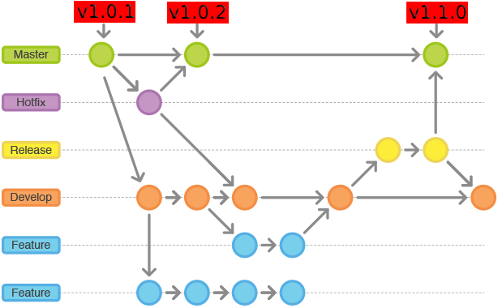

# NGES Frontend Framework
1. [Architectural Specifications](#frontend-framework-architectural-specifications)
1. [Frontend Framework Manageability & Versioning](#frontend-framework-manageability-and-versioning)
1. [Framework Project Layout](#framework-project-layout)
1. [Framework Ember Data Support](#framework-ember-data-support)
1. [Rest Http Client For Restful Request](#rest-http-client-for-restful-request)
1. [Framework Environment Meta Information](#framework-environment-meta-information)
3. [Frontend Framework Reusable Resources](#frontend-framework-reusable-resources)


# Frontend Framework Architectural Specifications

Frontend Framework Two Types of Meta Configuration:

  -	[Design Meta].
  -	[Business Meta].

#### 1. Design Meta:
  When components were developed their Look and Feel or UI & UX meta information defined into Fronted Engine. Developed components must be isolated so that easily business meta can be consumable.
  
  > Query Notes: 
  
  - [X] Components UI & UX meta will be given as resource.

#### 2. Business Meta:
  For populating components Look and Feel, Interact with Business meta information. Business meta provided by services.
  
  > Query Notes: 
  
  - [X] Business meta processed by template through consuming service API endpoints then UI will be populated.
  - [X] Needs resources and objects mapping configuration into service configuration file, so that based on user selection that resources can be render or populated.
  


| [Fronted Framework (Select resources, base on client meta)]                                  |
| -------------                                                                                |
| - Resources (Process Service Meta & logical implementation which developed by developer)     |
| - Reusable Resources (Developed as isolated resource library by nges frontend team)          |


## Frontend Framework Manageability and Versioning

Frontend Framework manageability & Versioning policy for multiple product team.

- [ ] `Process: 1` - Initial work start from `develop branch` then multiple feature developed in `feature branches` features will be merge into `develop branch` for current or future release.
- [ ] `Process: 2` - if requirement and functionality implemented then ready for release, now `develop branch` merged into `release branch` 
- [ ] `Process: 3` - if everything going well, then merge into `master branch` and ready to release version tag like (v1.0.1 to v1.1.0. ...more [Check Versionign Policy]).
 Otherwise create `hotfixes branch` and update major production issues and release version tag like (v1.0.1 to v1.0.2 ...more).
- [ ] `Process: 4` - multiple team start with `latest` or `stable` version. (eg. Here, `last release will be latest` and `v1.1.0 is stable`)


Development, versioning and management flow for `NGES Team`





## Versioning policy for multiple product team.


- [ ] Always Front Framework on one Baseline Version (`latest`, `stable`). 
- [ ] Development Team will `start` with `stable version`. 
- [ ] NGES team will `continuously improve` the `stable` changing the `version` number in 2nd and 3rd digit. `v1.0.1, v1.0.2,...`
- [ ] The `development team` will `pull this manually` but the `compatibility and TODO guideline` should always be provided by NGES team.


## Framework Project Layout

> Project layout is important to organize service and other resources

```
 app
  ├── adapters
  |   ├── nges-core
  |   ├── nges-elements
  |   ├── nges-engines
  |   |   ├── auth-engine
  |   |   ├── olm
  |   |   ├── property-externder
  |   |   ├── tree-engine
  |   |   └── more..
  ├── components
  |   ├── nges-base
  |   ├── nges-core
  |   ├── nges-elements
  |   ├── nges-engines
  |   |   ├── auth-engine
  |   |   ├── olm
  |   |   ├── property-externder
  |   |   ├── tree-engine
  |   |   └── more..
  |   └── nges-services
  |   |   ├── cbs
  |   |   ├── rms
  |   |   └── ...more
  |
  ├── helpers
  |   ├── nges-core
  |   ├── nges-elements
  |   ├── nges-engines
  |   |   ├── auth-engine
  |   |   ├── olm
  |   |   ├── property-externder
  |   |   ├── tree-engine
  |   |   └── more..
  |   ├── nges-services
  |   |   ├── cbs
  |   |   ├── rms
  |   |   └── ...more
  |   └── more..
  |
  ├── services
  |   ├── nges-core
  |   ├── nges-elements
  |   ├── nges-engines
  |   |   ├── auth-engine
  |   |   ├── olm
  |   |   ├── property-extender
  |   |   ├── tree-engine
  |   |   └── more..
  |   ├── nges-services
  |   |   ├── cbs
  |   |   ├── rms
  |   |   └── ...more
  |
  ├── mixins
  |   ├── nges-core
  |   ├── nges-elements
  |   ├── nges-engines
  |   |   ├── auth-engine
  |   |   ├── olm
  |   |   ├── property-extender
  |   |   ├── tree-engine
  |   |   └── more..
  |   ├── nges-services
  |   |   ├── cbs
  |   |   ├── rms
  |   |   └── ...more
  |
  ├── models
  |   ├── nges-core
  |   ├── nges-elements
  |   ├── nges-engines
  |   |   ├── auth-engine
  |   |   ├── olm
  |   |   ├── property-extender
  |   |   ├── tree-engine
  |   |   └── more..
  |   ├── nges-services
  |   |   ├── cbs
  |   |   ├── rms
  |   |   └── ...more
  |
  ├── templates
  |   ├──components
  |   ├── nges-core
  |   ├── nges-elements
  |   ├── nges-engines
  |   |   ├── auth-engine
  |   |   ├── olm
  |   |   ├── property-extender
  |   |   ├── tree-engine
  |   |   └── more..
  |   ├── nges-services
  |   |   ├── cbs
  |   |   ├── rms
  |   |   └── ...more
```

> Description: `components`,`templates`,`services`,`helpers`,`mixins`,`adapter`,`models`,`style` directory contains `nges-base`, `nges-core`, `nges-elements` and `nges-services`. 
  
  - `nges-base` folder contains framework resources.
  - `nges-core` folder contains `atomic components` so that those can be maximum reusable for future resource libraries.
  - `nges-elements` folder contains `complex ui`, using groups of `nges-core` components as `resource libraries`.
  - `nges-services` folder contains services, services layouts and it's logical implementations as resource.
  - `nges-engines` folder contains engines, workflow implementations as resource libraries.

```
// sample structure
 app
  ├── components
  |   ├── nges-core
  |   ├── nges-elements
  |   ├── nges-engines
  |   |   ├── olm
  |   |   ├── ppe
  |   |   ├── rue
  |   |   ├── tee
  |   |   └── more..
  |   ├── nges-services
  |   |   ├── cbs
  |   |   ├── rms
  |   |   └── ...more
  
```
  
  
  
  
  
  


## Framework Ember Data Support

Frontend Framework Adapters & Models Setup

- Adapter use for XHR (REST API Requests) 
- We can configure backend host, URL format and headers used to talk to a REST API in an adapter
- If we use EmberData then, we need to configure adapters.

Frontend Framework Support two types of model creations

- Static model and
- Dynamic model

#### Static Model Creation

To create static models config adapters and models manually

```
 app
  ├── adapters
  |   ├── nges-core
  |   ├── nges-elements
  |   ├── nges-engines
  |   |   ├── olm
  |   |   ├── ppe
  |   |   ├── rue
  |   |   ├── tee
  |   |   └── more..
  ├── models
  |   ├── nges-core
  |   ├── nges-elements
  |   ├── nges-engines
  |   |   ├── auth-engine
  |   |   ├── olm
  |   |   ├── property-extender
  |   |   ├── tree-engine
  |   |   └── more..
```

##### Example implementation:- for static model creation:

> Define model in `models/nges-engines/person.js`

```javascript

  import config from 'frontend-engine/config/environment';
  import DS from 'ember-data';

  
  export default DS.Model.extend({
    name: DS.attr('string'),
    surname: DS.attr('string')
  });
  
```

> Define adapter `adapters/nges-engines/person.js`

```javascript

 import config from 'frontend-engine/config/environment';

  export default DS.JSONAPIAdapter.extend({
    host: config.NGES_SERVICE_HOSTS.MOCK_SERVICE_HOST,
  
    ajaxOptions() {
      let hash = this._super(...arguments);
      let { beforeSend } = hash;
  
      hash.beforeSend = xhr => {
        xhr.setRequestHeader('content-type', 'application/json');
        xhr.setRequestHeader('authorization', 'Bearer ' + 'accessToken-sadhan');
      };
      return hash;
    },
  
  });
```

#### Dynamic Model Creation

```javascript

export default Component.extend({

  // import services on the top 
  appWelcome: service('nges-core/app-welcome'),
  store: service(),
  
  init() {
    this._super(...arguments);
    let context = this;
  
     let url = config.NGES_SERVICE_HOSTS.MOCK_SERVICE_HOST + "/getTableHeader";
        return this.appRestTemplate.httpRestClient(url,  "GET", null, null).then(function (results) {
      
        let modelName = 'nges-services/pom/nges-table';         // model name base on adapter configuration
        let tableColumns = {};
        let tableHeaders = results;                             // this changes with endpoint
     
        // make ember model base on attributes
        for (let i = 0; i < tableHeaders.length; i++) {
      
          if (tableHeaders.type === 'String') {
            tableColumns[tableHeaders.name] = DS.attr('string');
          } else if (tableHeaders.type === 'double') {
            tableColumns[tableHeaders.name] = DS.attr('number');
          }
        }
      
        context.appWelcome.createDynamicModel(modelName, tableColumns);
        context.store.findAll('nges-services/pom/nges-table').then(function (blogPosts) {
          console.log('message-blogPosts', blogPosts);
        });
        
        context.set('tableHeaders', tableHeaders);
      });
        
  }
})

```  


#### NGES-Engines Resource Meta Configurations

open `app/nges-engines/nges-engines-configuration.js` file,

 ```javascript
 
  let enginePath = 'nges-engines';
  export default [
  
    {
      appCode: 'rms',                       // Must define same service name
      appPanelCode: 'admin-panel',          // Must define access panel
      appModuleCode: 'common',              // Must define module code, for type selection
      appMenuTemplateCode: 'olm',           // Must define for menu type selection
      label: 'OLM',                          // Engine display name
      templatePath: enginePath + '/olm',    // define engine root directory
      templates: [
        {
          label: 'Object State',            // Define engine label for Display Name
          code: 'object-state',             // Through code, resource will be identify. [route path map to code]
          name: 'object-state',             // Through name, resource will be render. [it basically raw resource file name which will render] 
          detailPath: '/',                  // Through detailPath,`details page` nested directory will be configurable  
          detailView: []                    // detail view page then you can configure those with code, name. [**Optional]
        },
        {
          label: 'Object State',
          code: 'diagram-tool',
          name: 'diagram-tool',
          detailPath: '/',
          detailView: [
            {
             label: 'Object State',
             code: 'detail-page-code',
             name: 'detail-page-file-name'
            }
          ]                    
        },
        
         // ... config meta, for more pages template if needed
      ]
    }
    //... config meta, more engines if needs
  ]

 ```
 Here, appCode, appPanelCode, appModuleCode, appMenuTemplateCode information will get from service
 
 
#### NGES-Services Resource Meta Configurations

> open `app/nges-services/pom/nges-services-configuration.js`
 
 ```javascript
 
  let servicePath = 'nges-services';
  export default [
    {
     appCode: 'rms',                          // Must define same service name    
     appPanelCode: 'operation',               // Must define access panel      
     appModuleCode: 'collection',             // Must define module code, for type selection                
     appMenuTemplateCode: 'remitters',        // Must define for menu type selection                      
     label: 'Remitters',                      // Engine display name        
     templatePath: servicePath + '/rms',      // define engine root directory                        
     templates: [
       {
         code: 'pom',                         // Through code, resource will be identify. [route path map to code]
         name: 'payorder-management',         // Through name, resource will be render. [it basically raw resource file name which will render] 
         detailPath: '/',                     // Through detailPath,`details page` nested directory will be configurable  
         detailView: [                        // detail view page then you can configure those with code, name. [**Optional]
           {
             label: 'payorder-details',
             code: 'pom-detail-view',
             name: 'payorder-details',
           },
           
           // ... more details pages if needs
         ],
       },
       
       // ... config meta, for more pages template if needed
     ]
   },
    // ... config meta, more services if needs
  ]

 ```
 
Here, appCode, appPanelCode, appModuleCode, appMenuTemplateCode information will get from service.
 
> `Notes:` Engine and Service related required files, adapters, helpers, models, components, mixins, models, styles, templates are need to be package into predefined `NGES Project layouts`.


## Rest Http Client For Restful Request

`Custom Rest Http Client For Restful Request [API Client Wrapper]`

create ember service then call, create function, like below

```javascript

export default Service.extend({

  //...more
  examplePersonRequest() {
    let roles = JSON.stringify([1, 2, 3]);         // convert your object to string
    
    let beforeSend = function (xhr) {
      xhr.setRequestHeader('content-type', 'application/json');
      xhr.setRequestHeader('authorization', 'Bearer ' + accessToken);
    };
    
    // if any property not want to pass then simply keep it null
    let headers = {
      'Authorization': 'Basic xxxxxxxxxxxxx',
      'Accept': 'application/json',
      'Content-Type': 'application/json'
    };
    
    let url = this.treeEngineHost + "/menuTrees/findMenuTreeByRoleList";
    return this.appRestTemplate.httpRestClient(url, "POST",
      roles, headers, beforeSend
    ); // it return promise
  }
  
});
```


## Framework Environment Meta Information

> To Framework meta configuration,  `config/environment.js`

```

APP: {
  appName: 'Frontend Framework',        // change application name
  appTitle: 'Frontend as Service',      // change application title 
  appLogo: 'logo.png'                   // change application logo, [Put logo in public folder]
}

```

> NGES all UI HOST configuration

```javascript

ENV.NGES_UI_HOSTS = {
  TREE_ENGINE_UI_HOST: 'http://localhost:4300',
  AUTH_ENGINE_UI_HOST: 'http://localhost:4400',
  PROPERTY_EXTENDER_ENGINE_UI_HOST: 'http://localhost:4200',
  
  //... more ui hosts
};

```

> NGES all backend services host configuration

```javascript

ENV.FRONTEND_SERVICE_HOSTS = {
  OLM_SERVICE_HOST: 'http://www.example.com',
  TREE_SERVICE_HOST: 'http://www.example.com',
  MOCK_SERVICE_HOST: 'http://192.168.20.2:8089',
  AUTH_SERVICE_HOST: 'http://www.example.com',
  
  //.. more Backend Service hosts
};

```

> `Optional:` if want to configuration you engine in different environment then define your environment here..

```javascript

if (environment === 'development') {

ENV.FRONTEND_SERVICE_HOSTS['AUTH_SERVICE_HOST'] = 'http://www.example.com';
ENV.FRONTEND_SERVICE_HOSTS['OLM_SERVICE_HOST'] = 'http://www.example.com';

//.. more Backend and UI Hosts
}

```

> `Notes`: Change or include host url or environment meta if needed.


## Frontend Framework Reusable Resources

- nges-common-grid
- nges-autocomplete
- nges-multi-select-box
- nges-item-selector-box
- nges-dual-list-box
- nges-link-to


## How to use `nges-common-grid`

Create `app/components/nges-services/rms-example/rms-example-file.js` and includes

```javascript

let  serviceActionableRoute = {
      create: {
        routePath: 'create-remitter',
        label: 'New Remitter',
      },
      edit: {
        routePath: 'edit-remitter',
        label: 'View Remitter',
      }
    };

this.set('serviceActionableRoute', serviceActionableRoute)

```

Create `app/templates/components/nges-services/rms-example/rms-example-file.hbs` and includes

```handlebars

{{nges-elements/nges-common-grid
  serviceActionableRoute = serviceActionableRoute
}}

```


## How to use `nges-autocomplete`

Create `app/components/nges-services/rms-example/rms-example-file.js` and includes

```javascript

let sampleDataList = [
      {"id": 1, "disabled": false, "selected": false, "displayName": "Dhaka", "value": "dhaka"},
      {"id": 3, "disabled": false, "selected": false, "displayName": "Nazipur", "value": "nazipur"},
      {"id": 4, "disabled": false, "selected": true, "displayName": "Naogaon", "value": "nogaon"}
    ];
this.set('sampleDataList', sampleDataList);

//... callback method
actions() {
  autocompleteOnSelectAction(selectedValue){
    console.log('message', selectedValue);
  }
}

```

Create `app/templates/components/nges-services/rms-example/rms-example-file.hbs` and includes

```handlebars

{{nges-core/nges-autocomplete
  dataList=sampleDataList
  displayName='Place Holder Name'
  autocompleteOnSelect=(action 'autocompleteOnSelectAction')
}}

```


## How to use `nges-multi-select-box`

Create `app/components/nges-services/rms-example/rms-example-file.js` and includes

```javascript

 let componentData = {
      itemId: 'itemIdWillBeUnique',   // it should be unique in same view page
      initialData: [
        {
          "label": "Group A",
          "data": [
            {"id": 1, "disabled": false, "selected": false, "view": "Bangladesh", "value": "bangladesh"},
            {"id": 2, "disabled": false, "selected": true, "view": "Japan", "value": "japan"},
            {"id": 3, "disabled": true, "selected": false, "view": "USA", "value": "usa"}
          ]
        },
        {
          "label": "Group B",
          "data": [
            {"id": 1, "disabled": false, "selected": false, "view": "Dhaka", "value": "dhaka"},
            {"id": 3, "disabled": false, "selected": false, "view": "Nazipur", "value": "nazipur"},
            {"id": 2, "disabled": false, "selected": true, "view": "Naogaon", "value": "nogaon"}
          ]
        }
      ]
    };
this.set('componentData', componentData);

```

Create `app/templates/components/nges-services/rms-example/rms-example-file.hbs` and includes

```handlebars

{{nges-core/nges-multi-select-box componentData=componentData}}


```


## How to use `nges-item-selector-box`

Create `app/components/nges-services/rms-example/rms-example-file.js` and includes

```javascript

this.set('selectBoxDataLists', [
    {'name': 'Bangladesh', 'selected': false,},
    {'name': 'Dhaka', 'selected': true,},
  ]);

//... get selected value
actions: {
  getItemSelectorBoxData() {
    console.log('message', JSON.stringify(this.get('selectBoxDataLists')));
  }
}

```

Create `app/templates/components/nges-services/rms-example/rms-example-file.hbs` and includes

```handlebars

{{nges-core/nges-item-selector-box groupLabel='nges-item-selector-box' selectBoxDataLists=selectBoxDataLists}}
<button {{action 'getItemSelectorBoxData'}}>Get Data</button>

```


## How to use `nges-dual-list-box`

Create `app/components/nges-services/rms-example/rms-example-file.js` and includes

```javascript

  let data_available = [
    {attributes: {id: 1, name: "Dhaka"}},
    {attributes: {id: 2, name: "Mirpur"}}
  ];
  let data_selected = [
    {attributes: {id: 1, name: "Dhanmondi"}}
  ];
    
  let data = {
    available: data_available,
    selected: data_selected
  };

  this.set('dualBoxData', data);  // selected values automatically updated
  
```

Create `app/templates/components/nges-services/rms-example/rms-example-file.hbs` and includes

```handlebars

{{nges-elements/sadhan-dual-list-box dualBoxData = dualBoxData}}

```


## How to use `nges-link-to`


step 1: create `example-remitter-registration.js` file and include

```js
this.set('params', {
      page: 'page1',
      age: '24',
})
```

step 2: create `example-remitter-registration.hbs` file and include

```handelbar
{{nges-core/nges-link-to
  routePath = 'create-remitter'
  label =  'Create Remitter'
  params = params
}}
```
step3: to access params helper method

```js
//...
appConfiguration: service('app-configuration');     // declare service 

//.... call method to get params
console.log('params', this.appConfiguration.getRouteURLParams());
```
